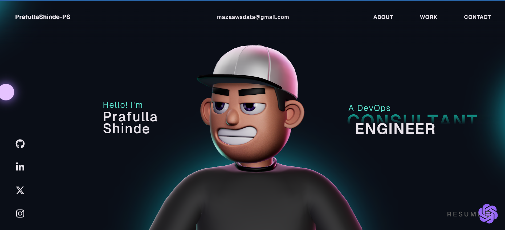

# My Portfolio Wesbite - Overview 🚀

This repository contains the open source version of my porfolio website.
Do check it out!

## Instructions 🛠️

I have modified the gsap club plugins with the trial plugins, but with the trial plugin you cannot host it🔴. So for Club plugins, Check out here: https://gsap.com/docs/v3/Installation/

**Techstack** - AWS Cloud, Docker, OpenShift, Terraform, Google Cloud, Shell Script, Jenkins, GitHub, Maven, Ansible, Kubernetes.




## Hosting on GitHub Pages 🌐

Follow these steps to deploy this project on GitHub Pages:

### Prerequisites
- A [GitHub](https://github.com) account
- [Node.js](https://nodejs.org/) and npm installed
- Git installed and configured

### Steps

**1. Clone the repository**
```bash
git clone https://github.com/PrafullaS/prafulla-portfolio.git
cd prafulla-portfolio
```

**2. Install dependencies**
```bash
npm install
```

**3. Update `vite.config.ts`** — set the `base` to your repo name:
```ts
export default defineConfig({
  base: "/prafulla-portfolio/",
  plugins: [react()],
});
```

**4. Update `package.json`** — set the `homepage` field:
```json
"homepage": "https://<your-github-username>.github.io/prafulla-portfolio/"
```

**5. Deploy to GitHub Pages**
```bash
npm run deploy
```
This will build the project and push the output to the `gh-pages` branch automatically.

**6. Enable GitHub Pages**
- Go to your repository on GitHub
- Navigate to **Settings → Pages**
- Under **Source**, select the `gh-pages` branch and click **Save**

**7. Visit your live site** 🎉
```
https://<your-github-username>.github.io/prafulla-portfolio/
```

> **Note:** For future updates, just run `npm run deploy` again to redeploy.

---

## License

This project is open source and available under the [MIT License](LICENSE).
